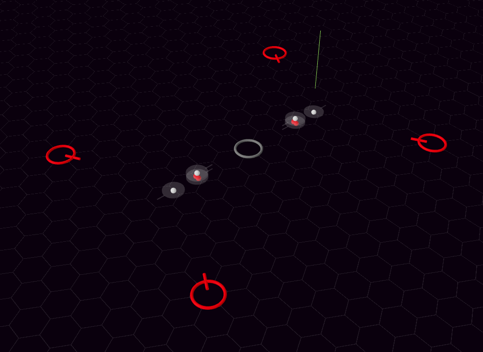

#  gamma-quantum

## Play [development build](https://ndry.github.io/gamma-quantum/) on GitHub Pages

## Build

`npm i`

`npm run build`

Find built app in `./dist/` folder,
this does not need web-server to run, 
can just be opened in any browser as local file

## Run dev locally

`npm i`

`npm run start`

Go to http://127.0.0.1:6742/
